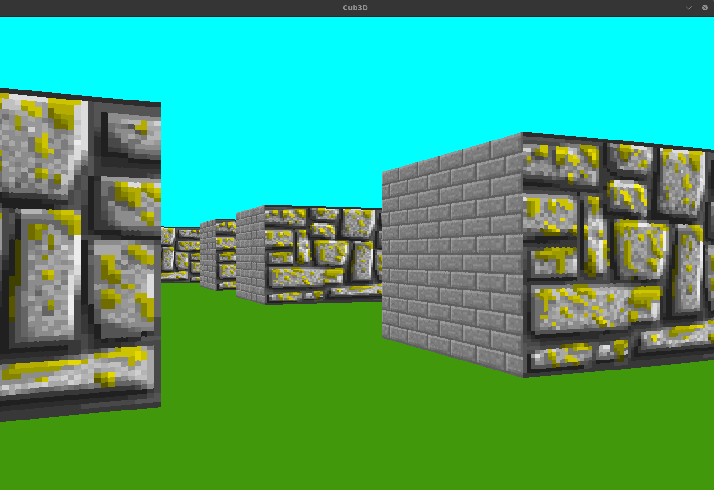

*This project has been created as part of the 42 curriculum by moaatik, hbenmoha*

# Cub3D

A simple Wolfenstein 3D-inspired raycasting engine written in C using MiniLibX.

<p align="center">
  
</p>

## About

Cub3D is a graphics project from the 42 curriculum.

The goal is to build a first-person 3D renderer using the Raycasting technique,
similar to early games like Wolfenstein 3D.

This project was developed entirely in C using:
- MiniLibX
- X11 / OpenGL
- mathematical raycasting
- texture mapping
- real-time rendering

## Features

- Real-time raycasting renderer
- Textured walls
- Player movement
- Collision detection
- Camera rotation
- Map parsing
- Custom `.cub` configuration files
- Keyboard controls
- Linux & macOS support

## Raycasting

Raycasting is a rendering technique used to simulate a 3D environment
from a 2D map.

For every vertical column on the screen:
1. A ray is cast from the player position
2. The ray travels through the map grid
3. DDA is used to detect wall intersections
4. The distance to the wall is calculated
5. A vertical textured slice is rendered

## DDA Algorithm

The Digital Differential Analyzer (DDA) algorithm is used to efficiently
step through the 2D grid map.

Instead of checking every pixel,
the ray jumps directly from one grid cell to another until a wall is found.

This makes raycasting fast enough for real-time rendering.

## Rendering Pipeline

The renderer works as follows:

1. Clear previous frame
2. Process player input
3. Cast rays
4. Detect wall hits
5. Compute wall height
6. Apply textures
7. Draw vertical stripes
8. Push image to the window

## MiniLibX

The project uses MiniLibX (MLX),
a lightweight graphics library provided by 42.

MLX handles:
- window creation
- image buffers
- keyboard events
- rendering pixels
- event loops

## Map Configuration

Maps are stored inside `.cub` files.

Example:

```txt
NO textures/wall_north.xpm
SO textures/wall_south.xpm
WE textures/wall_west.xpm
EA textures/wall_east.xpm

F 220,100,0
C 225,30,0

111111111111
100000000001
100000000001
1000N0000001
100000000001
111111111111
```

### Symbols

| Symbol | Meaning |
|---|---|
| `1` | Wall |
| `0` | Empty space |
| `N` | Player spawn facing North |
| `S` | Player spawn facing South |
| `E` | Player spawn facing East |
| `W` | Player spawn facing West |

### Creating Your Own Map

Users can create custom maps by:
- editing wall layouts
- changing player spawn positions
- replacing textures
- modifying floor/ceiling colors

The map must:
- be fully closed by walls
- contain exactly one player spawn
- use valid texture paths

## Controls

| Key | Action |
|---|---|
| W | Move forward |
| S | Move backward |
| A | Strafe left |
| D | Strafe right |
| ← | Rotate left |
| → | Rotate right |
| ESC | Exit |
| SHIFT | Sprint |

## Build

Clone the repository:

```bash
git clone --recurse-submodules https://github.com/moaatik/Cub3D.git
cd Cub3D
make
./cub3D maps/map.cub
```
